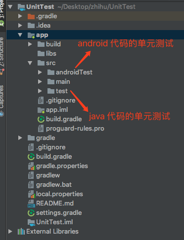
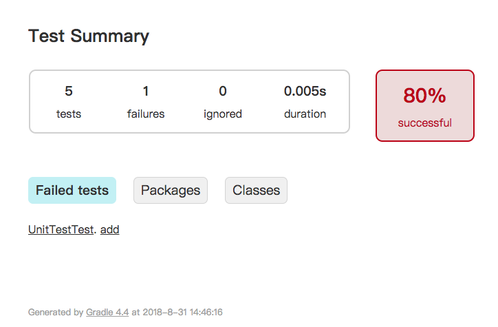

# 单元测试
单元测试（unit testing），是指对软件中的最小可测试单元进行检查和验证。
Java 里单元指的是一个类。

单元测试（模块测试）是开发者编写的一小段代码，用于检验被测代码的一个很小的、很明确的功能是否正确。
通常而言，一个单元测试是用于判断某个特定条件（或者场景）下某个特定函数的行为。



[官方文档](https://developer.android.com/studio/test/)

## 一个简单的单元测试
1.在 main 目录下新建一个 UnitTest 类，里面包含一个 add 求和的方法
```java
public class UnitTest {

    public int add(int a, int b){
        return a + b;
    }
}
```
2.对 add 进行单元测试，在 test 对应目录下创建 UnitTestTest，或者在 UnitTest 下 右键 -> Go To -> Test
```java
public class UnitTestTest {

    private UnitTest unitTest;

    @Before
    public void setUp(){
        unitTest = new UnitTest();
    }

    @Test
    public void add() throws Exception {
        int result = unitTest.add(1, 2);
        assertEquals(3, result);
    }

}
```
3.在 UnitTestTest 右键 -> Run "UnitTestTest", 执行结果如下
```java
Process finished with exit code 0
```

4.如果修改验证值
```java
    @Test
    public void add() throws Exception {
        int result = unitTest.add(1, 2);
        assertEquals(4, result);
    }
```
执行结果：
```
    java.lang.AssertionError: 
    Expected :4
    Actual   :3
     ...
    Process finished with exit code 255
```

## 用命令 ./gradlew testDebugUnitTest 执行所有的单元测试
执行完毕后，会在 app/build/reports/tests/testDebugUnitTest/ 目录下生成 index.html 测试报告



## Junit4 使用介绍

[junit4 wiki](https://github.com/junit-team/junit4/wiki)

[junit4 javadoc](https://junit.org/junit4/javadoc/latest/)

### 常用注解
| 注解名 | 含义 |
| ------ | ------ |
| @Test | 表示是测试方法 |
| @Before | 每个测试方法前执行，可做初始化操作 |
| @After | 每个测试方法后执行，可做释放资源操作 |
| @BeforeClass | 在类中所有方法执行前执行，必须是 static |
| @AfterClass | 在类中所有方法执行后执行，必须是 static |
| @Ignore | 忽略的测试方法 |
| @Parameters | 指定测试类类的测试数据集合|
| @Rule | 重新制定测试类中方法的行为 |
| @FixMethodOrder | 指定测试类中方法的顺序 |

#### @Test
对于每一个单元测试方法，都会加一个 @Test 注解。
```java
@Retention(RetentionPolicy.RUNTIME)
@Target({ElementType.METHOD})
public @interface Test {
    static class None extends Throwable {
        private static final long serialVersionUID = 1L;

        private None() {
        }
    }

    Class<? extends Throwable> expected() default None.class;

    long timeout() default 0L;
}
```
通过上面的代码，可以看到 Test 可以传两个值：expected、timeout

* expected 用来验证方法会抛出某个异常，如果没有抛出异常，则会失败

```java
    @Test(expected=IndexOutOfBoundsException.class) 
    public void outOfBounds() {
        new ArrayList<Object>().get(1);
    }
```

* timeout 如果测试方法执行的时间超过了 timeout 的值，就会失败

```java
    @Test(timeout=100) 
    public void sleep100() {
       Thread.sleep(100);
    }
```

### 常用方法
| 方法名 | 方法描述 |
| -- | -- |
| assertEquals | 判断预期值与实际值相等 |
| assertNotEquals | 判断预期值与实际值不相等 |
| assertArrayEquals | 判断数组相等 |
| assertNull | 判断为空 |
| assertNotNull | 判断不为空 |
| assertTrue |  判断为真 |
| assertFalse | 判断为假 |
| assertSame | 判断引用相同，相当于 “==“ |
| assertNotSame | 判断引用不同，相当于 "!=" |
| assertThat | 判断值是否满足条件 |
| fail | 让测试方法失败 |

注：上面的每一个方法，都有一个重载的方法，可以在前面加一个String类型的参数，表示如果验证失败的话，将用这个字符串作为失败的结果报告。
比如：assertEquals("a and b not equals", "a", "b");


#### AssertThat
```java
    public static <T> void assertThat(T actual, Matcher<? super T> matcher) {
        assertThat("", actual, matcher);
    }
    public static <T> void assertThat(String reason, T actual,
            Matcher<? super T> matcher) {
        MatcherAssert.assertThat(reason, actual, matcher);
    }
```
reason 为断言失败时的输出信息， actual 为断言的值，matcher 为断言的匹配器

| 匹配器 | 说明 | 例子 |
| --- | --- | --- |
| is | 判断相等 | assertThat(1，is(1)) |
| not | 判断不想等 | assertThat(1, not(1)) |
| equalTo | 判断相等 | assertThat(1, equalTo(1)) |
| equalToIgnoringCase | 判断字符串忽略大小写 | assertThat("Ab", equalToIgnoringCase("ab")) |
| containsString | 包含字符串 | assertThat("ab", containsString"b")) |
| startsWith | 以什么字符串开始 | assertThat("ab", startsWith("a")) |
| endsWith | 以什么字符串结尾 | assertThat("ab", endsWith("b")) |
| nullValue | 判断为 null | assertThat(null, nullValue()) |
| notNullValue | 判断不为 null | assertThat(1, notNullValue()) |
| greaterThan | 判断大于 | assertThat(1, greaterThan(0)) |
| lessThan | 判断小于 | assertThat(1, lessThan(2)) |
| greaterThanOrEqualTo | 大于或等于 | assertThat(1, greaterThanOrEqualTo(0)) |
| lessThanOrEqualTo | 小于或等于 | assertThat(1, lessThanOrEqualTo(2)) |
| closeTo | 判断浮点数在某一范围 | assertThat(1.0, closeTo(0.0, 2.0)) |
| allOf | 相当于 && | assertThat(1, allOf(greaterThan(0), lessThan(2))) |
| anyOf | 相当于 || | assertThat(1, anyOf(greaterThan(1), lessThan(2))) |
| hasKey | Map 集合有 key 值 | assertThat(map, hasKey("key")) |
| hasValue | Map 集合有 value 值 | assertThat(map, hasValue("value")) |
| hasItem | 含有某元素 | assertThat(list, hasItem(element)) |


## [Mockito](https://site.mockito.org/)

[wiki](https://github.com/mockito/mockito/wiki)

[Unit tests with Mockito](http://www.vogella.com/tutorials/Mockito/article.html)

Mockito 的使用
1. 验证方法调用
2. 指定 mock 对象的某些方法的行为

### 先看一个例子
1.有 LoginPresenter 类
```java
public class LoginPresenter {

    private LoginManager mLoginManager;

    public LoginPresenter(LoginManager loginManager){
        mLoginManager = loginManager;
    }

    public void login(String name, String pwd){
        if("".equals(name) || "".equals(pwd)){
            return;
        }

        mLoginManager.performLogin(name, pwd);
    }
}
```
2.用户登陆时，调用 LoginManager 的 login 方法

如何对 LoginPresenter 的 login 方法进行单元测试？
```java
    @Test
    public void login() throws Exception {
        LoginManager loginManager = Mockito.mock(LoginManager.class);
        LoginPresenter loginPresenter = new LoginPresenter(loginManager);

        String name = "admin";
        String password = "admin123";
        loginPresenter.login(name, password);

        Mockito.verify(loginManager).performLogin(name, password);
    }
```

### mock 数据
如果不指定的话，一个mock对象的所有非void方法都将返回默认值：int、long类型方法将返回0，boolean方法将返回false，对象方法将返回null等等；而void方法将什么都不做。

### mock 返回值

| 方法名 | 方法描述 |
| --- | --- | --- |
| thenReturn | 设置要返回的值 |
| thenThrow| 要抛出的异常 |
| thenAnswer | 对结果进行拦截 |
| doReturn | 提前设置要返回的值 |
| doThrow | 设置抛出的异常 |
| doAnswer | 对结果进行拦截 |
| doCallRealMethod | 调用真实方法 |
| doNothing | 什么都不做 |

例子：
```java
when(model.getName()).thenReturn("thenReturn Name");

doReturn("do return name").when(model).getName();
```

### verify
| 方法名 | 方法描述 |
| --- | --- |
| after | 在给定的时间后进行验证 |
| timeout | 验证方法执行是否超时 |
| atLeast | 方法至少执行 n 次|
| atMost | 方法最多执行 n 次 |
| description | 验证失败时输出的内容 |
| times | 验证调用方法的次数 |
| never | 验证没有执行过，相当于 times(0) |
| only | 验证方法只被执行一次，类似 times(1) |

### any 参数匹配器
| 方法名 | 方法描述 |
| --- | --- | 
| anyObject | 匹配任何对象 |
| any(Class<T> type) | 匹配任何对象 |
| any | 匹配任何对象 |
| anyBoolean | 匹配任何非空 boolean |
| anyByte | 匹配任何非空 Byte |
| anyCollection | 匹配任何非空 Collection |
| anyDouble | 匹配任何非空 Double |
| anyFloat | 匹配任何非空 Float |
| anyInt | 匹配任何非空 Int |
| anyList | 匹配任何非空 List |
| anyLong | 匹配任何非空 Long |
| anyMap | 匹配任何非空 Map |
| anyString | 匹配任何非空 String |
| contains | 参数包含给定的字符串 |
| argsThat | 创建自定义的参数匹配模式 |

### spy 实现调用真是对象的实现
spy与mock的唯一区别就是默认行为不一样：spy对象的方法默认调用真实的逻辑，mock对象的方法默认什么都不做，或直接返回默认值。

### inOrder 验证执行顺序

### @InjectMocks 自动将模拟对象注入到被测试对象

## [Robolectric](http://robolectric.org/)

如果在设备上测试是很慢的，因为编译、安装、运行 app 需要花费几分钟或者更多的时间。

RobolectRict 是一个可以运行安卓代码的单元测试框架，测试在你的电脑上运行只需要几秒钟。

它通过实现一套JVM能运行的Android代码，从而做到脱离Android运行环境进行测试。

### 日志输出
### 验证 Activity 跳转
### 验证 Toast
### 验证 Dialog
### 验证 CheckBox 状态
### 验证 Fragment
### 访问资源文件
### Activity 生命周期
### 验证 BroadcastReceiver
### Service 验证

### 网络接口测试
* 拦截器 mock
* server mock
* 正常请求测试

### RxJava 测试
* demo：计时器


